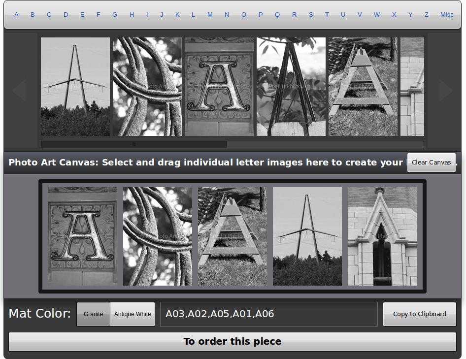

# spellitphotoart



## About

You can make the word with manuplating and processing of photo.

## Install & Run

```bash
# clone our repo
$ git clone https://github.com/Big-Silver/spellitphotoart.git spellitphotoart
# change directory to your app
$ cd spellitphotoart
# install npm
$ npm install
# Run project
$ npm start
# Visit to the browser
$ http://localhost:8000
```